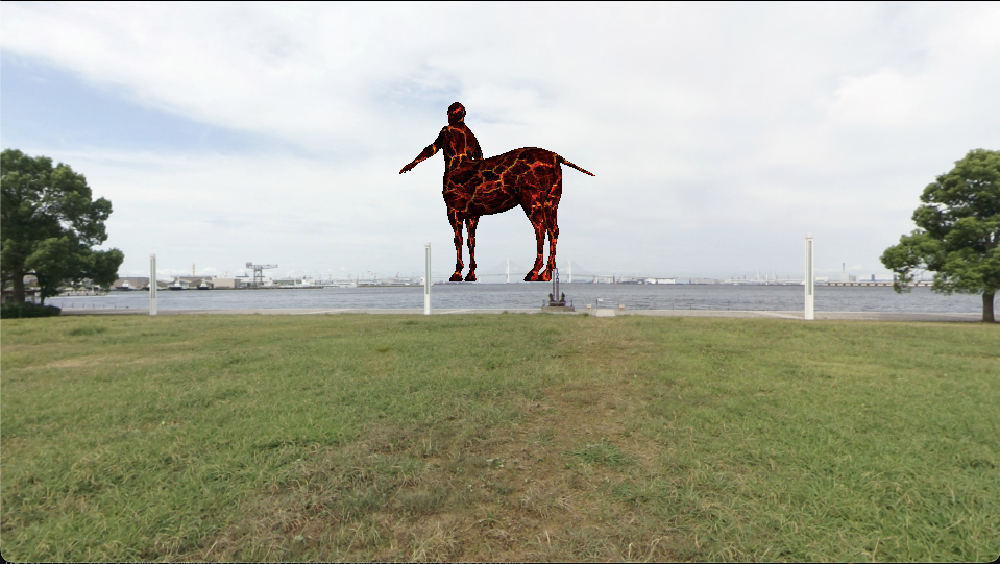
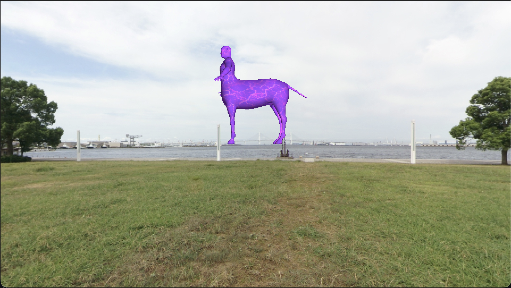
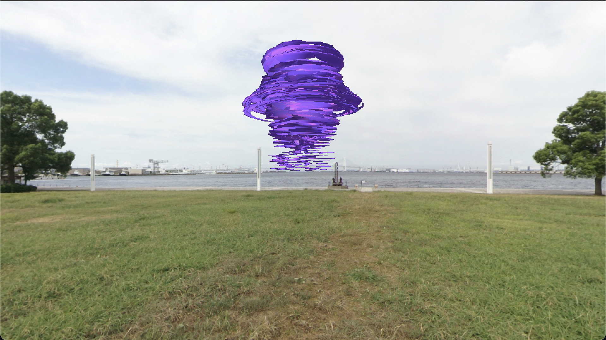

# 🎮 OpenGL Shader Renderer

Un renderizador OpenGL avanzado en Python con una colección impresionante de vertex y fragment shaders para efectos visuales dinámicos y espectaculares.

## 📸 Galería de Efectos

### Renderizado Original

*Modelo básico con shader estándar*

### Fragment Shader de Energía

*Efecto de energía pulsante aplicado*

### Combinación: Twist + Energía

*Deformación twist + energía pulsante = efecto épico*

## 🚀 Características

- **Renderizado OpenGL en tiempo real** con pygame
- **Sistema de shaders modular** - combina cualquier vertex shader con cualquier fragment shader
- **Efectos visuales avanzados** - desde deformaciones geométricas hasta efectos de energía pulsante
- **Controles interactivos** - ajusta efectos en tiempo real
- **Compatibilidad macOS** - optimizado para OpenGL 2.1/GLSL 120

## 🎯 Shaders Implementados

### 🔷 Vertex Shaders (Deformación Geométrica)

| Tecla | Shader                 | Descripción                     | Efecto Visual                             |
| ----- | ---------------------- | ------------------------------- | ----------------------------------------- |
| **1** | **Basic Vertex**       | Shader básico sin deformaciones | Renderizado estándar con iluminación      |
| **2** | **Twist Deformation**  | Deformación en espiral          | El objeto se retuerce en forma helicoidal |
| **3** | **Bend + Ripple**      | Curvatura + ondas sinusoidales  | Curvatura en X + ondas de agua animadas   |
| **4** | **Explode/Wave**       | Explosión radial animada        | Ondas expansivas desde el centro          |
| **5** | **Noise Displacement** | Desplazamiento con ruido 3D     | Superficie orgánica con ruido procedural  |

### 🔶 Fragment Shaders (Efectos de Color/Textura)

| Tecla | Shader                      | Descripción                   | Efecto Visual                              |
| ----- | --------------------------- | ----------------------------- | ------------------------------------------ |
| **6** | **Basic Fragment**          | Shader básico con iluminación | Texturizado estándar                       |
| **7** | **Halftone/Dot Pattern**    | Patrón de puntos tipo cómic   | Efecto halftone con puntos dinámicos       |
| **8** | **Dissolve/Disintegration** | Efecto de disolución          | Objeto se desintegra con bordes brillantes |
| **9** | **Pulsating Energy**        | Energía eléctrica pulsante    | Pulsos de energía azul/púrpura             |

## 🎮 Controles

### Navegación
- **Flechas**: Mover cámara (↑↓ = Z, ←→ = X)
- **WASD**: Mover luz puntual
- **F**: Toggle wireframe/filled mode

### Shaders
- **1-5**: Seleccionar vertex shader
- **6-9**: Seleccionar fragment shader
- **Q/A**: Aumentar/disminuir intensidad del efecto
- **E**: Reset efectos a valor 0

## 🌟 Combinaciones Recomendadas

### 🔥 Efectos Dramáticos
- **4 + 9**: Explosión + Energía = Explosión energética épica
- **2 + 9**: Twist + Energía = Espiral de energía pura
- **5 + 8**: Ruido + Disolución = Desintegración orgánica

### 🎨 Efectos Artísticos
- **3 + 7**: Bend+Ripple + Halftone = Agua estilo cómic
- **2 + 7**: Twist + Halftone = Espiral psicodélica
- **1 + 8**: Basic + Dissolve = Disolución limpia

### ⚡ Efectos Futuristas
- **4 + 8**: Explosión + Disolución = Desintegración explosiva
- **5 + 9**: Ruido + Energía = Superficie alienígena energizada

## 🛠️ Instalación y Configuración

### Requisitos
- Python 3.8+
- macOS (optimizado para OpenGL 2.1)

### Dependencias
```bash
conda create -n py38 python=3.8
conda activate py38
pip install pygame PyOpenGL PyOpenGL_accelerate PyGLM numpy
```

### Ejecución
```bash
python RendererOpenGL.py
```

## 📁 Estructura del Proyecto

```
RENDERER/
├── README.md                 # Este archivo
├── RendererOpenGL.py        # Aplicación principal
├── gl.py                    # Clase Renderer OpenGL
├── vertexShaders.py         # Colección de vertex shaders
├── fragmentShaders.py       # Colección de fragment shaders
├── buffer.py                # Manejo de buffers de vértices
├── model.py                 # Carga y renderizado de modelos 3D
├── camera.py                # Sistema de cámara
└── textures/               # Texturas y skyboxes
```

## 🎨 Detalles Técnicos de los Shaders

### Vertex Shaders

#### 🌪️ Twist Deformation
- **Algoritmo**: Rotación matricial basada en altura Y
- **Uniforms**: `value` (intensidad del twist)
- **Efecto**: Rotación helicoidal progresiva

#### 🌊 Bend + Ripple
- **Bend**: Curvatura en arco usando coordenadas polares
- **Ripple**: Ondas sinusoidales animadas con tiempo
- **Uniforms**: `value` (radio de curvatura), `ambientLight` (amplitud de ondas)

#### 💥 Explode/Wave
- **Algoritmo**: Desplazamiento radial desde centro + ondas temporales
- **Efecto**: Ondas expansivas con pulso temporal
- **Visual**: Simulación de explosiones o pulsaciones

#### 🧩 Noise Displacement
- **Ruido**: Función 3D multi-octava con múltiples frecuencias
- **Animación**: Desplazamiento temporal en múltiples velocidades
- **Resultado**: Superficie orgánica en constante movimiento

### Fragment Shaders

#### 🎯 Halftone Pattern
- **Técnica**: Cuantización de luz + patrones de puntos
- **Algoritmo**: Grid UV con máscaras circulares dinámicas
- **Estilo**: Efecto cómic/impresión offset

#### ⚡ Dissolve Effect
- **Método**: Threshold con ruido de textura + bordes brillantes
- **Control**: `value` controla progreso de disolución
- **Visual**: Desintegración con bordes de energía naranjas

#### 🔋 Pulsating Energy
- **Efectos múltiples**: Rim lighting + ondas concéntricas + líneas energéticas
- **Colores**: Azul eléctrico → Púrpura → Blanco (sobrecarga)
- **Animación**: 6 frecuencias diferentes de pulsación

## 💡 Características Avanzadas

### 🔄 Sistema Modular
- **Intercambiable**: Cualquier vertex shader funciona con cualquier fragment shader
- **Escalable**: Fácil agregar nuevos efectos
- **Optimizado**: Shaders compilados una vez, reutilizados

### 🎛️ Control en Tiempo Real
- **Parámetros dinámicos**: Ajuste de intensidad sin recompilación
- **Feedback visual**: Valores mostrados en consola
- **Respuesta inmediata**: Cambios instantáneos

### 🖥️ Compatibilidad
- **GLSL 120**: Compatible con OpenGL 2.1 (macOS legacy)
- **Atributos estándar**: `inPosition`, `inNormals`, `inTexCoords`
- **Uniforms consistentes**: Sistema unificado de parámetros


## 👨‍💻 Desarrollado por

**Mario Rocha** - Renderizador OpenGL con efectos de shaders avanzados

---
